# Spillburg Holdings — Enterprise Company Portal

[](https://www.python.org/)
[-brightgreen?style=for-the-badge)](requirements.txt)
[](https://render.com)
[](LICENSE)
[](render.yaml)

A unified, high-performance, **zero-external-dependency** enterprise management portal engineered for **Spillburg Holdings (Pvt) Ltd**.

The portal centralizes corporate governance, operational task tracking, customer file registers (with physical cabinet/cupboard indexing), digitized physical financial ledgers, and a comprehensive **dual-currency Payroll & Statutory Bank Remittance Hub** into a single, lightning-fast Single-Page Application (SPA).

---

## 🌐 Live Cloud Demo & Access

- **Production Cloud Instance**: [https://spillburg-portal.onrender.com](https://spillburg-portal.onrender.com) *(when deployed)*
- **Local Desktop Instance**: `http://127.0.0.1:8080`
- **One-Click Windows Launcher**: Run `Start_Spillburg_Portal.bat`

---

## 📸 Interface Gallery & Screenshots

Here is a visual walkthrough of the portal's core operational modules:

### 1. Executive Command Center & Operations Management

| Executive Dashboard | Corporate Operations Tracker |
|:---:|:---:|
| <a href="screenshots/02_executive_dashboard.png">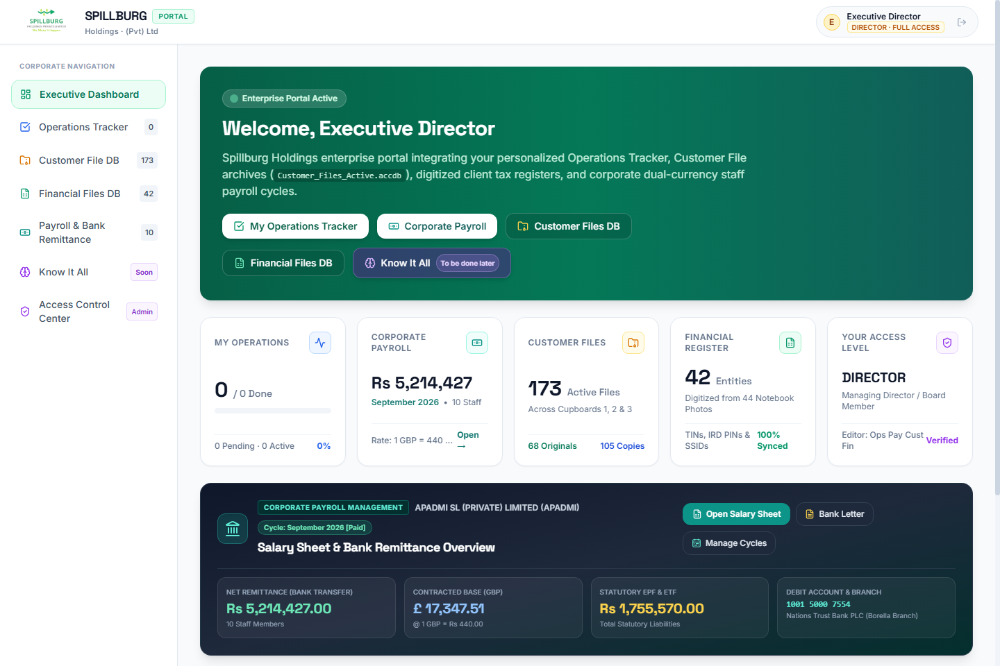</a> | <a href="screenshots/03_operations_tracker.png">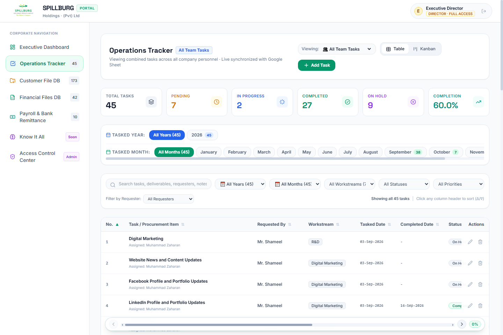</a> |
| **Real-time KPI cards, active payroll metrics, & operations status** | **Year & Month filters, status pills, & team deliverable queues** |

---

### 2. Dual-Currency Payroll & Bank Remittance Hub

| APADMI SL Salary Sheet (Dual Currency GBP / LKR) | Official Bank Remittance Request Letter |
|:---:|:---:|
| <a href="screenshots/08_payroll_dual_currency_sheet.png">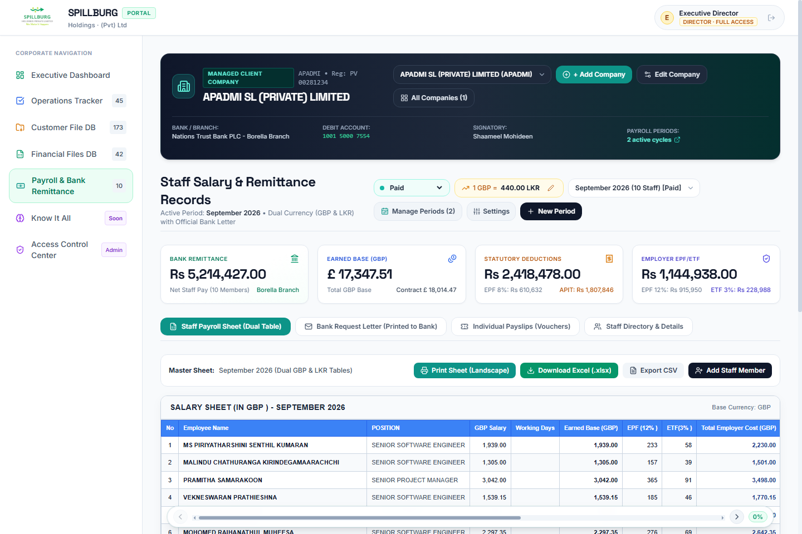</a> | <a href="screenshots/09_bank_remittance_letter.png">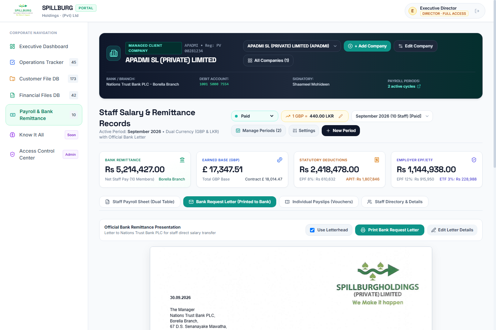</a> |
| **Live exchange rate calculator, EPF/ETF statutory taxes, & APIT** | **Formatted bank payment advice with official Spillburg letterhead** |

| Individual Staff Payslip Vouchers | Period Management & Creation Hub |
|:---:|:---:|
| <a href="screenshots/10_individual_payslips.png">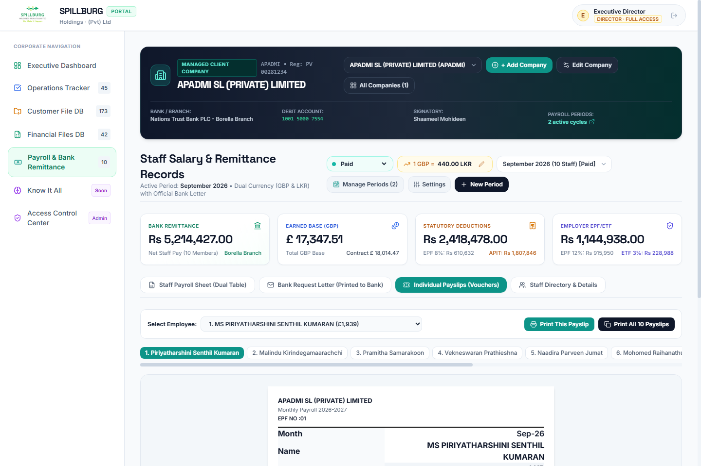</a> | <a href="screenshots/12_period_management_hub.png">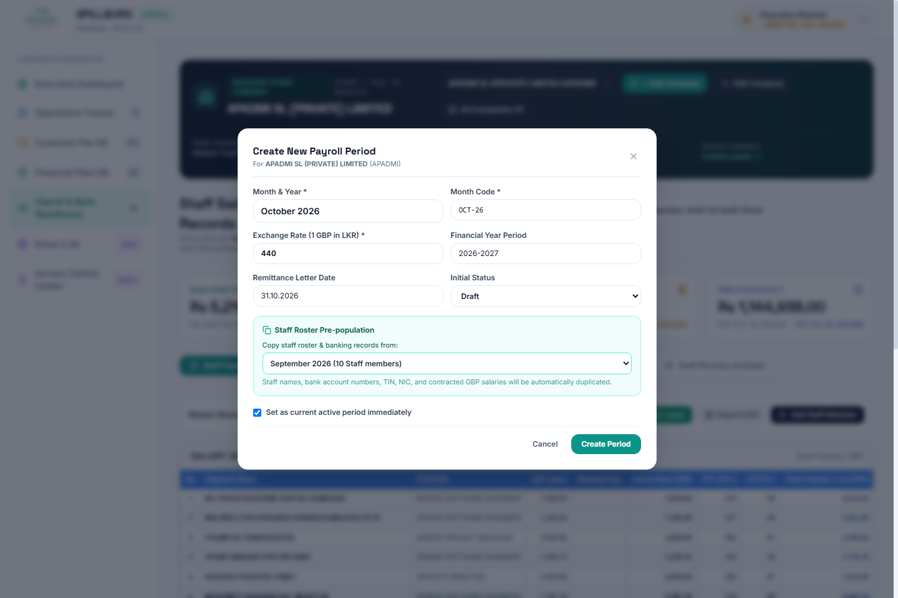</a> |
| **Confidential monthly employee pay slips ready for print/export** | **Multi-period lifecycle, roster cloning, & exchange rate control** |

---

### 3. Customer Files Database & Physical Cabinet Visualizer

| Master Customer Register (Data Table) | Physical Filing Cabinets & Box Visualizer |
|:---:|:---:|
| <a href="screenshots/04_customer_files_table.png">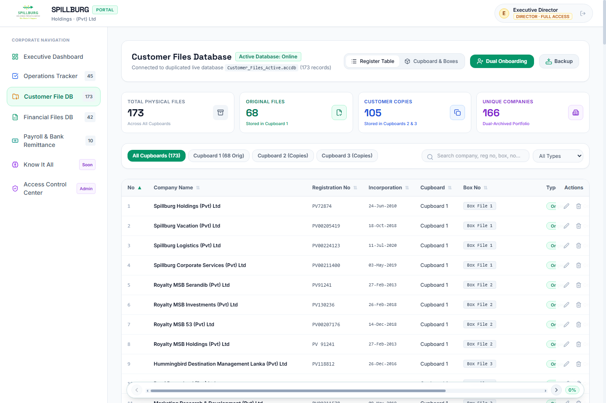</a> | <a href="screenshots/05_customer_files_physical_cabinets.png">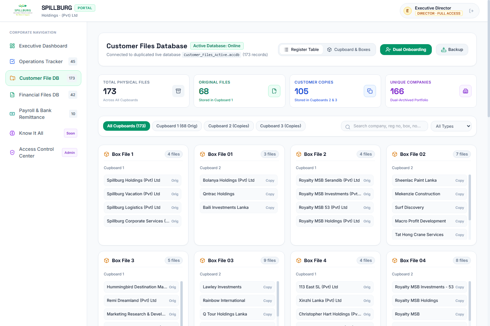</a> |
| **Master register with PV numbers, company names, & export tools** | **Interactive Cupboards 1, 2, & 3 paper document locator** |

---

### 4. Digitized Financial Files & System Administration

| Financial Files & Tax Identity Register | High-Resolution Lightbox Inspection Modal |
|:---:|:---:|
| <a href="screenshots/06_financial_files_ledger.png">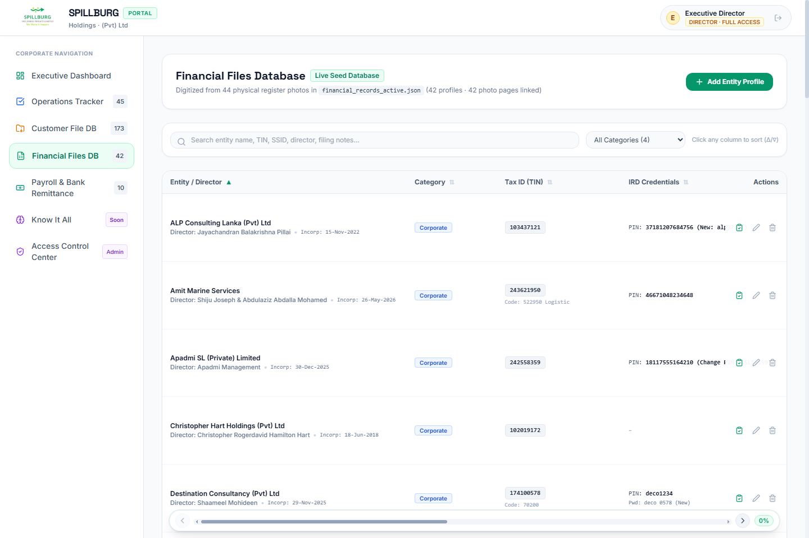</a> | <a href="screenshots/07_financial_files_lightbox.png">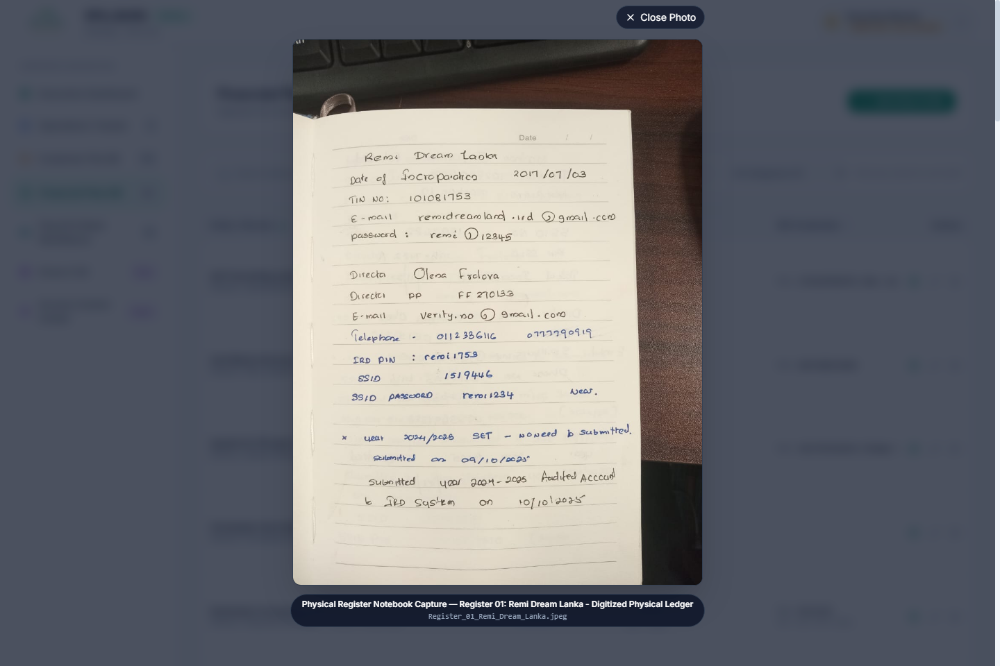</a> |
| **Digitized corporate entities, TINs, IRD PINs, & audit records** | **Full-resolution scanned physical ledger notebook page viewer** |

| Access Control Center & Staff Directory | Secure Employee Sign-In Portal |
|:---:|:---:|
| <a href="screenshots/11_access_control_governance.png">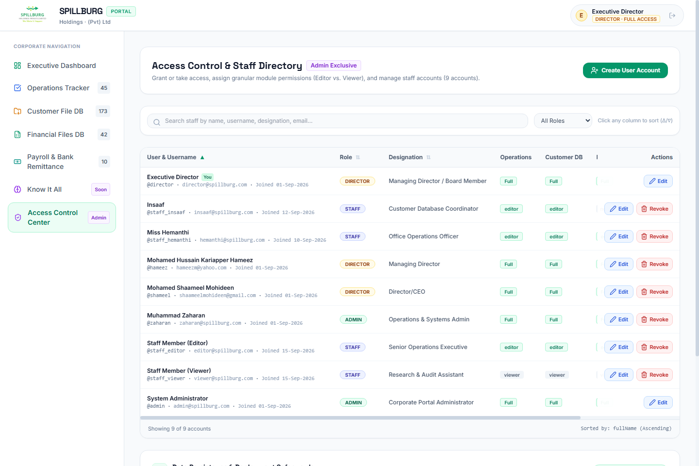</a> | <a href="screenshots/01_login_screen.png">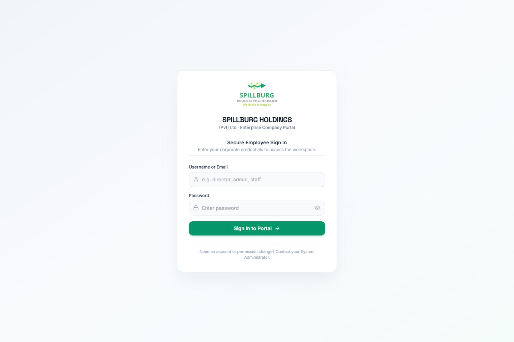</a> |
| **Role-Based Access Control (RBAC) & granular module permissions** | **Branded employee login with token-based security governance** |

---

## ⚡ Key Highlights & Capabilities

- **Zero Pip Dependencies**: Runs 100% out of the box using only the Python 3 Standard Library (`http.server`, `socketserver`, `sqlite3`, `json`, `urllib`, `zipfile`, `xml.etree`).
- **Pure Python OpenXML Spreadsheet Engine (`payroll_excel.py`)**: Generates genuine, styled Microsoft Excel (`.xlsx`) workbooks dynamically on the fly without third-party libraries like `openpyxl` or `pandas`.
- **Comprehensive Dual-Currency Payroll Hub**:
  - Contracted base salaries recorded in Great British Pounds (GBP).
  - Real-time exchange rate converter (e.g., `1 GBP = 440.00 LKR`) with instantaneous net remittance recalculation.
  - Complete Sri Lankan statutory payroll deductions: **EPF 8%** (Employee), **EPF 12%** (Employer), **ETF 3%** (Employer), and **APIT** (Advance Personal Income Tax).
  - Automated partial-month working days proration (e.g. 17 Days worked vs full month).
  - Formatted Bank Remittance Request Letter incorporating official Spillburg letterhead graphics.
  - Printable individual employee monthly payslip vouchers.
  - Multi-company management with period creation, locking, and roster cloning.
- **Operations Tracker with Granular Date Filtering**:
  - **Tasked Date Year Filter**: Filter tasks across calendar years (`All Years`, `2026`, etc.).
  - **Tasked Date Month Filter**: Fast pill filters across all 12 calendar months (`All Months`, `September (38)`, `October (7)`, etc.).
  - **Dynamic Requester & Workstream Dropdowns**: Auto-populated searchable menus with inline `+ Add New...` creation dialogs.
  - **Isolated Personal vs Team Workspaces**: Seamless switching between individual deliverables and total team queues.
- **Dual-Mode Customer Register Database**:
  - **Local Windows Mode**: Interfaces directly with Microsoft Access (`Customer_Files_Active.accdb` / `Office File Register.accdb`) via 32-bit PowerShell OLEDB 16.0 engine.
  - **Cloud / Cross-Platform Mode**: Auto-syncs and gracefully fails over to SQLite3 (`customers.sqlite`) and JSON persistence on Linux/Render.com environments.
- **Physical Box & Cupboard Visualizer**: Interactive visual filing cabinet index mapping documents across Cupboards 1, 2, and 3 for instant paper document retrieval.
- **Dual-Record Company Onboarding**: Automatically creates paired entries for company registration: **Original File** (Cupboards 1 & 3) and **Customer Copy** (Cupboard 2).
- **Digitized Financial Ledger Archive**: Searchable catalog of 42+ physical ledger book pages and payment vouchers with high-resolution inspection modal and zoom controls.
- **Cloud Persistence & Auto-Sync**: Automatic detection and restoration of latest timestamped production backups from `backup_files/` upon container deployment on Render.com.
- **Role-Based Access Control (RBAC)**: Fine-grained permissions (Director, Admin, Staff Editor, Staff Viewer) with secure token-based session management.
- **Fluid Horizontal Table Scrollbar**: Custom floating sticky bottom scrollbar with smooth nudge controls for widescreen data tables.

---

## 🏛️ Comprehensive Module Breakdown

### 1. Executive Dashboard
- **Executive KPI Summary**: Live counts of active database status, total operations tasks, registered customer files, financial records, and monthly payroll obligations.
- **Payroll Integration**: Highlights net bank remittance, contracted GBP volume, employer statutory liabilities, and debit account details directly on the executive home view.
- **Quick Action Cards**: Direct navigation to Operations Tracker, Corporate Payroll, Customer Files, and Financial Archives.
- **Deliverable Overview**: Progress bar and completion metrics tracking pending, in-progress, and completed tasks.

### 2. Corporate Operations Tracker
- **Task Management**: Tracks deliverable titles, assigned staff members, requesters, workstreams, tasked dates, completion dates, estimated costs, notes, priorities (`Critical`, `High`, `Medium`, `Low`), and statuses (`Pending`, `In Progress`, `Completed`, `On Hold`).
- **Tasked Date Year & Month Filters**: Quick switcher pills and dropdown selectors to isolate tasks by calendar year and month.
- **Dynamic Dropdowns with "+ Add New..."**: Requester and Workstream select menus automatically populate from existing tasks, with modal support to register new clients or departments instantly.
- **Role-Aware Views**: Directors and Admins can toggle between personal tasks (`My Personal Tasks`), all team deliverables (`All Team Tasks`), or inspect specific staff queues.
- **Dual Display Modes**: Sortable 10-column data table and visual Kanban board.
- **Sticky Scrollbar Integration**: Smooth horizontal navigation across wide tabular layouts.

### 3. Customer Files Database
- **Master Corporate Register**: Indexes 170+ client company files with Registration Numbers (`PV...`), Dates of Incorporation, Assigned Cupboards, Box Numbers, and Document Types (`Original` vs `Customer Copy`).
- **Dual View Modes**:
  - **Register Table**: Searchable, sortable grid with column filtering, quick search, and edit/delete drawers.
  - **Cupboard & Boxes Visualizer**: Card-based physical representation of Cupboards 1, 2, and 3 showing file counts per box for physical paper retrieval.
- **Dual-Record Onboarding**: Automatically generates paired entries for newly incorporated entities: an Original File placed in Cupboard 1 and a Customer Copy stored in Cupboard 2.
- **Database Backup & Export**: One-click timestamped database backup utility, clean CSV export, and dedicated print stylesheet.

### 4. Financial Files Database
- **Digitized Physical Ledger Catalog**: Searchable repository of 42+ scanned corporate ledger entries, tax registrations, and payment vouchers.
- **Tax Identity Indexing**: Catalogs Company/Director names, Categories (Corporate / Personal), Taxpayer Identification Numbers (TIN), IRD credentials, PINs, and SSIDs.
- **High-Resolution Lightbox**: Click any ledger thumbnail to launch an inspection modal with full-resolution rendering, zoom controls, and metadata overlays.

### 5. Payroll & Bank Remittance Hub
- **APADMI SL Private Limited & Client Company Engine**:
  - Manages employee rosters, designations, national identity numbers (NIC), tax identification numbers (TIN), and bank account details.
  - Supports multiple managed corporate entities with custom bank branches, debit account numbers, and authorized signatories.
- **Dual-Currency Salary Calculations**:
  - Base salaries contracted in Great British Pounds (GBP).
  - Dynamic exchange rate live adjuster (e.g., `1 GBP = 440.00 LKR`) with real-time recalculation of Gross Pay and Net Bank Remittance.
- **Sri Lankan Statutory Taxes & Deductions**:
  - **EPF 8%**: Employee contribution deduction from gross earnings.
  - **EPF 12%**: Employer contribution liability.
  - **ETF 3%**: Employer Employee Trust Fund contribution.
  - **APIT**: Advance Personal Income Tax calculation according to statutory income brackets.
  - **Total Employer Cost**: Complete employer liability computed in both LKR and GBP.
- **Partial-Month Work Days Proration**:
  - Automatic prorated calculations for partial attendance (e.g., 17 Days worked vs standard full month).
- **Pure Python OpenXML Excel Generator (`payroll_excel.py`)**:
  - Generates authentic `.xlsx` workbooks with zero external packages.
  - Exports dual tables: GBP Salary Sheet and LKR Remittance Sheet with formatted headers, borders, custom column widths, and Calibri typography.
- **Official Bank Payment Advice Letter**:
  - Formatted payment instruction letter addressed to Commercial Bank / Nations Trust Bank / Bank of Ceylon.
  - Automatically incorporates official Spillburg Holdings letterhead header and footer graphics.
  - Dedicated print stylesheet ready for PDF export or paper printing.
- **Individual Staff Payslips**:
  - Formatted monthly pay vouchers for each employee with itemized earnings, statutory withholdings, and net remittance.
  - Batch print or single-employee print preview.
- **Payroll Period Management Hub**:
  - Multi-period lifecycle management (`Draft`, `Approved`, `Paid`, `Closed`).
  - Period cloning: duplicate employee rosters, bank account numbers, and contracted salaries into future months with 1 click.
  - Period freeze and locking controls to safeguard historical accounting records.

### 6. Access Control Center & Security Governance
- **Role-Based Access Control (RBAC)**:
  - Granular permission matrix for each user across modules: Operations, Customer Files, Financial Files, Payroll, and User Management (`Full`, `Editor`, `Viewer`, `None`).
- **User Management**:
  - Create portal accounts, update designations, toggle permissions, and reset employee passwords.
- **Security Safeguards**:
  - Self-deletion guard prevents active administrators from accidentally deleting their own accounts.
  - Public registration endpoint is disabled (HTTP 403 Forbidden); account provisioning is strictly administrative.
  - Secure session token handling via `Authorization: Bearer <token>` and protected session cookies.

### 7. Cloud Persistence & Backup Infrastructure
- **Two-Way Disk Synchronization**: Real-time read/write synchronization between in-memory caches and persistent storage (`data/`).
- **Render.com Deployment Auto-Sync**: Automatically detects the latest timestamped production backup in `backup_files/` upon boot in ephemeral container environments and restores all tables, eliminating data loss during rebuilds.
- **1-Click System Backup & Restore**: Creates complete JSON snapshots containing users, operations, customer registers, and payroll periods.

---

## 🔐 Default User Roles & Credentials

| Role | Username | Password | Access & Permissions |
|:---|:---|:---|:---|
| **Executive Director** | `director` | `director123` | Full access across all corporate modules |
| **System Admin** | `admin` | `admin123` | Full access + User & Role Governance |
| **Managing Director** | `hameez` | `spillburg123` | Executive oversight across corporate data |
| **Operations Director**| `shameel` | `spillburg123` | Operations management & task allocation |
| **Systems Administrator**| `zaharan` | `admin123` | Operations administration & systems management |
| **Database Coordinator**| `staff_insaaf` | `staff123` | Customer files & operations editor |
| **Operations Officer** | `staff_hemanthi` | `staff123` | Operations, customer files, & payroll editor |
| **Staff Member (Editor)**| `staff_editor` | `staff123` | General editor access across active registers |
| **Staff Member (Viewer)**| `staff_viewer` | `staff123` | Read-only access across registers |

> **Security Notice:** Default credentials should be updated or rotated via the Access Control panel prior to exposing the portal to public untrusted networks.

---

## 🚀 Quick Start Guide

### Option A: Windows (One-Click Launcher)

1. Clone or download this repository:
   ```bash
   git clone https://github.com/muhzahjr07/company_portal.git
   cd company_portal
   ```
2. Double-click **`Start_Spillburg_Portal.bat`**.
3. The server starts at `http://127.0.0.1:8080` and automatically launches in your default browser.

---

### Option B: Command Line (Any Operating System)

Requires Python 3.9 or newer. **Zero pip installations required!**

```bash
# Clone the repository
git clone https://github.com/muhzahjr07/company_portal.git
cd company_portal

# Start the server (default port: 8080)
python server.py

# Or specify a custom port
python server.py 9000
```

Visit `http://localhost:8080` in your web browser and sign in.

---

### Option C: 1-Click Cloud Deployment on Render.com

This repository is pre-configured with `render.yaml` (Render Blueprint) and `Procfile`.

1. Push your repository to GitHub:
   - Run `Push_To_GitHub.bat` (Windows) or push via git CLI.
2. Sign in to [Render.com](https://dashboard.render.com).
3. Click **New +** → **Blueprint** (or **Web Service**).
4. Connect this GitHub repository (`company_portal`).
5. Render detects configuration automatically:
   - **Environment**: Python 3
   - **Build Command**: *(leave empty)*
   - **Start Command**: `python server.py`
   - **Plan**: Free
6. Click **Deploy**. Your permanent HTTPS link will be active in under 60 seconds!

---

## 📁 Repository Structure

```
company_portal/
├── .github/                       # GitHub actions workflows & community templates
│   ├── workflows/ci.yml           # Automated CI verification suite
│   ├── ISSUE_TEMPLATE/            # Bug report & feature request templates
│   └── pull_request_template.md   # Pull request checklist
├── backup_files/                  # Production JSON snapshot archives for auto-sync
├── customer_file_db/              # Customer file database & MS Access engine
│   ├── Customer_Files_Active.accdb# Active Access database file
│   ├── Office File Register.accdb # Master Access file register
│   ├── customers.sqlite           # SQLite cross-platform database
│   ├── server.ps1                 # Standalone 32-bit PowerShell REST server
│   └── backups/                   # Timestamped database backups
├── data/                          # Persistent JSON data stores & caches
│   ├── users.json                 # Role & user credentials store
│   ├── operations.json            # Active operations tasks
│   ├── financial_records.json     # Digitized financial metadata
│   ├── customer_records_cache.json# Customer records cache
│   ├── payroll_records.json       # APADMI & corporate payroll cycles
│   └── archived_master_tracker.json# Master task archive
├── financial_files_db/            # 42+ digitized physical ledger photo scans
├── payroll/                       # Baseline salary sheets, remittance templates, & PDFs
├── public/                        # Frontend Single-Page Application (SPA)
│   ├── index.html                 # HTML5 layout & application views
│   ├── app.js                     # Client logic, router, calculations, & state
│   ├── styles.css                 # Custom CSS & print layout styling
│   ├── logo.png                   # Official Spillburg Holdings brand logo
│   ├── letterhead_header.png      # High-resolution corporate letterhead header
│   ├── letterhead_footer.png      # High-resolution corporate letterhead footer
│   ├── spillburg_letterhead.jpg   # Full corporate letterhead background
│   └── manifest.json              # Web App Manifest (PWA support)
├── screenshots/                   # High-resolution application screenshots for GitHub
│   ├── 01_login_screen.png
│   ├── 02_executive_dashboard.png
│   ├── 03_operations_tracker.png
│   ├── 04_customer_files_table.png
│   ├── 05_customer_files_physical_cabinets.png
│   ├── 06_financial_files_ledger.png
│   ├── 07_financial_files_lightbox.png
│   ├── 08_payroll_dual_currency_sheet.png
│   ├── 09_bank_remittance_letter.png
│   ├── 10_individual_payslips.png
│   ├── 11_access_control_governance.png
│   └── 12_period_management_hub.png
├── scripts/                       # Developer automation utilities
│   └── generate_screenshots.py    # Automated headless browser screenshot suite
├── access_bridge.ps1              # 32-bit OLEDB bridge for Microsoft Access
├── inspect_db.ps1                 # Database diagnostic utility
├── payroll_excel.py               # Pure Python OpenXML Excel workbook generator
├── Procfile                       # Render / Heroku process declaration
├── Push_To_GitHub.bat             # 1-click GitHub deployment utility
├── render.yaml                    # Render Blueprint Infrastructure-as-Code
├── requirements.txt               # Pure Python stdlib indicator (Zero pip dependencies)
├── server.py                      # Multi-threaded Python HTTP/REST API server
├── Start_Spillburg_Portal.bat     # Windows one-click desktop launcher
├── verify_portal.py               # Automated end-to-end portal verification suite
├── verify_payroll.py              # Automated end-to-end payroll & Excel test suite
├── CONTRIBUTING.md                # Contribution guidelines
├── CODE_OF_CONDUCT.md             # Contributor Covenant code of conduct
├── SECURITY.md                    # Security policy & reporting guidelines
├── CHANGELOG.md                   # Chronological release log
└── LICENSE                        # MIT License
```

---

## 📡 REST API Reference

All protected endpoints accept session authorization via `Authorization: Bearer <token>` header or `token` cookie.

### Authentication
| Method | Endpoint | Description | Access |
|:---|:---|:---|:---|
| `POST` | `/api/auth/login` | Authenticate and obtain session token | Public |
| `POST` | `/api/auth/logout` | Invalidate active session token | Authenticated |
| `GET` | `/api/auth/me` | Fetch active user profile and permissions | Authenticated |
| `POST` | `/api/auth/register` | Public registration *(Blocked - returns 403)* | Disabled |

### Operations Tracker
| Method | Endpoint | Description | Access |
|:---|:---|:---|:---|
| `GET` | `/api/operations` | List operations tasks (with optional user/date filter) | Authenticated |
| `POST` | `/api/operations` | Create a new operations task | Editor / Admin |
| `PUT` | `/api/operations/<id>` | Update status, priority, dates, or task details | Editor / Admin |
| `DELETE` | `/api/operations/<id>` | Remove an operations task | Editor / Admin |
| `GET` | `/api/operations/stats` | Retrieve operations statistics and status metrics | Authenticated |

### Customer Files Database
| Method | Endpoint | Description | Access |
|:---|:---|:---|:---|
| `GET` | `/api/customer-files` | Retrieve file records & cupboard metadata | Authenticated |
| `POST` | `/api/customer-files` | Add a single customer file record | Editor / Admin |
| `POST` | `/api/customer-files/onboard` | Dual-record onboarding (Original + Copy) | Editor / Admin |
| `PUT` | `/api/customer-files/<no>` | Update company or cupboard placement | Editor / Admin |
| `DELETE` | `/api/customer-files/<no>` | Remove a customer file record | Editor / Admin |
| `POST` | `/api/customer-files/backup` | Create a timestamped Access database backup | Director / Admin |

### Financial Archives
| Method | Endpoint | Description | Access |
|:---|:---|:---|:---|
| `GET` | `/api/financial-files` | List financial photos & ledger metadata | Authenticated |
| `GET` | `/api/financial-files/photos/<file>` | Stream high-resolution ledger photo asset | Authenticated |
| `POST` | `/api/financial-files` | Create a new entity tax/ledger profile | Editor / Admin |
| `PUT` | `/api/financial-files/<id>` | Update entity tax credentials or references | Editor / Admin |
| `DELETE` | `/api/financial-files/<id>` | Remove a financial file profile | Editor / Admin |

### Payroll & Bank Remittance
| Method | Endpoint | Description | Access |
|:---|:---|:---|:---|
| `GET` | `/api/payroll` | Fetch complete payroll data, companies, & active period | Authenticated |
| `POST` | `/api/payroll/period` | Create new payroll period (with optional roster cloning)| Editor / Admin |
| `PUT` | `/api/payroll/period` | Update exchange rate, status, or period settings | Editor / Admin |
| `DELETE` | `/api/payroll/period` | Delete a payroll period | Editor / Admin |
| `GET` | `/api/payroll/export-xlsx` | Download dynamic pure-Python OpenXML `.xlsx` spreadsheet| Authenticated |
| `GET` | `/api/payroll/export-csv` | Download dual-currency payroll CSV file | Authenticated |
| `POST` | `/api/payroll/employee` | Add an employee to active payroll roster | Editor / Admin |
| `PUT` | `/api/payroll/employee` | Update employee salary, work days, or banking info | Editor / Admin |
| `DELETE` | `/api/payroll/employee` | Remove an employee from payroll roster | Editor / Admin |
| `POST` | `/api/payroll/company` | Register a new client company profile | Editor / Admin |
| `PUT` | `/api/payroll/company` | Update client company bank/debit details | Editor / Admin |
| `DELETE` | `/api/payroll/company` | Remove client company profile | Editor / Admin |

### User Management & Governance
| Method | Endpoint | Description | Access |
|:---|:---|:---|:---|
| `GET` | `/api/users` | List all system users and roles | Admin Only |
| `POST` | `/api/users` | Create a new portal user | Admin Only |
| `PUT` | `/api/users/<id>` | Modify role, permissions, designation, or password | Admin Only |
| `DELETE` | `/api/users/<id>` | Delete user (with self-deletion guard) | Admin Only |

---

## 🧪 Automated Testing & Verification Suites

The repository includes two automated end-to-end verification suites testing data integrity, statutory math, security barriers, and OpenXML Excel generation:

### 1. General Portal & Security Verification (`verify_portal.py`)
```bash
python verify_portal.py
```
Tests:
- Master Sheet Archive Integrity (`data/archived_master_tracker.json`).
- Active Access DB & SQLite resilience.
- Multi-Role Authentication (Director, Admin, Muhammad Zaharan, Staff Editor, Staff Viewer).
- Public registration block (HTTP 403 Forbidden).
- Admin User Management & self-deletion guard (HTTP 400 Bad Request).
- Customer Files and Financial Registers API responses.

### 2. Payroll & OpenXML Engine Verification (`verify_payroll.py`)
```bash
python verify_payroll.py
```
Tests:
- Letterhead static asset delivery.
- APADMI SL September 2026 statutory totals match (Row 39 exact totals: Net Remittance Rs 5,214,427.00).
- Partial-month work day deduction calculation (Kushani: 17 D -> Rs 308,908.00).
- Dynamic OpenXML `.xlsx` export byte stream, XML parsing, and Calibri typography.
- Dual-table CSV export format.
- Live exchange rate modification and automatic recalculation.

---

## 📄 License

This project is licensed under the **MIT License** — see the [LICENSE](LICENSE) file for details.

---

## 🏢 Organization & Author

**Spillburg Holdings (Pvt) Ltd**  
*Corporate Hub & Technology Infrastructure*  
Author & Lead Developer: **Muhammad Zaharan** ([@muhzahjr07](https://github.com/muhzahjr07))
